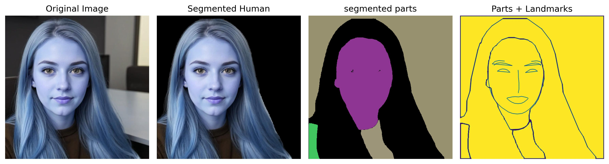

# Face Segmentation with SAM and MediaPipe

Script for combining Segment Anything Model (SAM) with MediaPipe face detection to segment images and detect facial features.

## Setup

1. Install requirements:
```bash
pip install -r requirements.txt
```

2. Download SAM checkpoint file:
- Get `sam_vit_b_01ec64.pth`
- Place in script directory

3. Prepare image:
- Put your image in script directory
- Update image path in main()

## Run

```bash
python main.py
```

## Functions

`resize_image(image, max_dim=512)`
- Resizes image keeping aspect ratio
- Returns resized image

`draw_face_landmarks(image)`
- Detects face landmarks using MediaPipe
- Returns landmark coordinates

`show_anns(anns, image, face_landmarks)`
- Shows segmentation and landmarks
- Colors:
  * Eyebrows - Brown
  * Eyes - Yellow
  * Lips - Cyan
  * Nose - Magenta
  * Face - Gray

## Output

- Shows original image and segmentation side by side
- Prints number of segments found

## Limits

- Works with single face only
- Max image size: 512px
- Random colors for segments
- Fixed colors for facial features